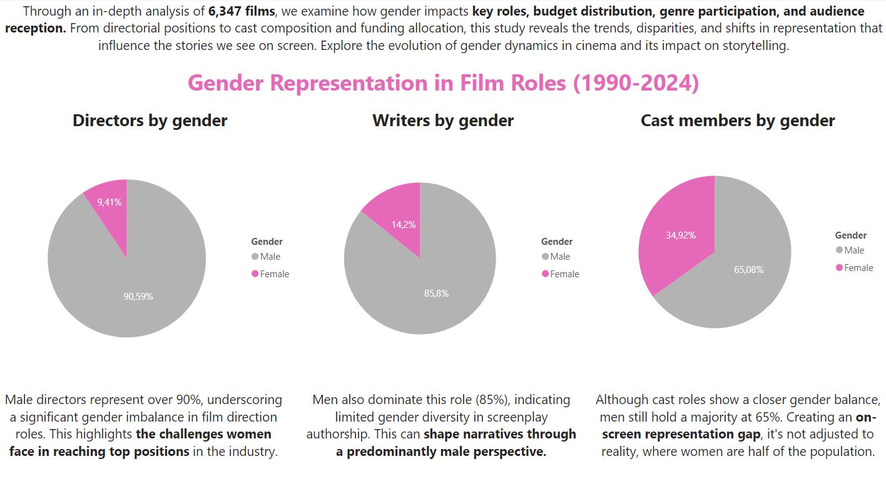
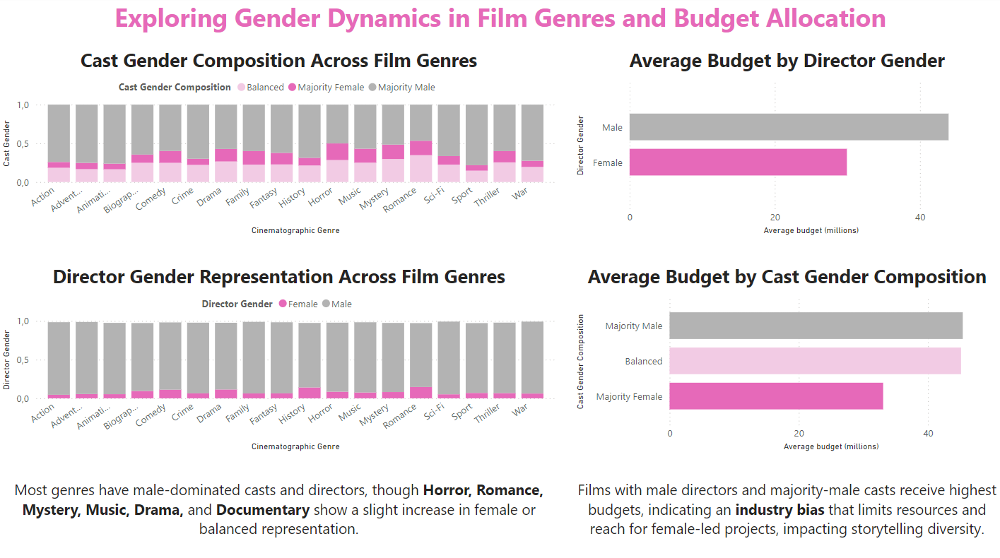
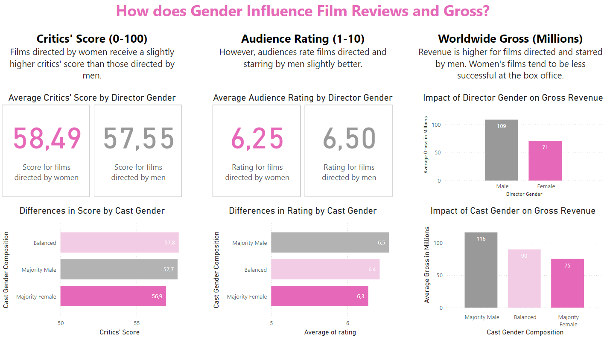
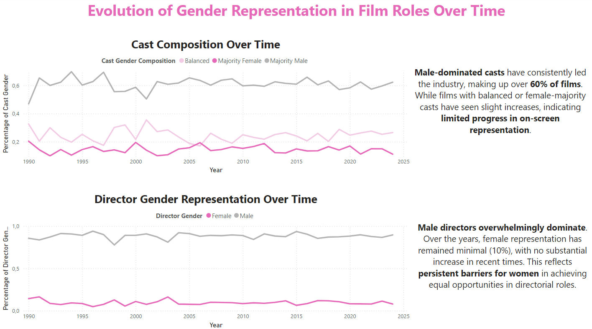

# 🎥 Gender Representation in Movie Analysis Project

This project explores **gender representation in the cinema industry** by analyzing IMDb data on movies, with a focus on understanding gender disparities in roles like **director, writer, and cast**, as well as the relationship between gender and factors such as **genre, budget, ratings, and box office performance**.

[🌟 Presentation summarizing all the project 🌟](https://docs.google.com/presentation/d/1UT_MTcW6d-LaUZ7WXHO5RCZRxvm1VhwnCvxnXFVNDmk/edit?usp=sharing)

---

## 📁 Repository Structure

- **code/**: Contains the main notebooks for data processing and exploratory analysis.
  - `main.ipynb`: Notebook for **data extraction, cleaning, and preparation**, loading data into SQL.
  - `exploratory_analysis.ipynb`: Notebook for **exploratory analysis** and SQL-driven insights on gender dynamics.

- **data/**: Contains datasets for the project.
  - `raw/`: Raw data files from IMDb.
  - `clean/`: Cleaned datasets after transformation.

- **sql/**: SQL scripts for database management.
  - `create_tables.sql`: Creates the database schema.
  - `analysis_queries.sql`: Queries for analyzing gender representation.

- **utils/**: Utility scripts, including `functions.py` for data cleaning and transformation.

- **visualizations/**: Dashboards for data visualization.
  - `gender_representation.pbix`: Power BI dashboard.
  - `gender_representation.pdf`: PDF with dashboard snapshots.

- **requirements.txt**: Python libraries and dependencies.

- **README.md**: Project documentation.

---

## 🔍 Project Overview

This project investigates **gender dynamics in the cinema industry** using **10,000 movies** from IMDb. It examines gender representation across roles, genres, budgets, and ratings to uncover patterns and trends impacting the industry.

### Focus Areas

1. **Role Representation**: Proportion of male and female directors, writers, and cast across genres.
2. **Genre Distribution**: Gender dynamics within genres (e.g., Action, Comedy, Drama).
3. **Budget Allocation**: Disparities in **budget and revenue** by gender.
4. **Audience & Critic Ratings**: Influence of gender on ratings and box office performance.

---

## 📊 Data Sources

Data was obtained from IMDb, ensuring comprehensive movie details:
- [**IMDb Movies Data (10,000 movies)**](https://www.kaggle.com/datasets/amanbarthwal/imdb-movies-data): Primary details such as **title, year, rating, metascore, director, cast, and genre**.
- [**IMDb Movies Data with Budget and Gross (9,083 movies)**](https://www.kaggle.com/datasets/elvinrustam/imdb-movies-dataset): Additional fields for **budget, gross revenue, and writer information**.

Combining both datasets enabled a comprehensive analysis with consistent movie titles for accurate merging.

---

## 🛠️ Methodology

### Data Preparation
- **Standardization**: Column names standardized; datasets merged by **movie title**.
- **Filtering**: Focus on movies released between 1990 and 2024, filling in missing values.
- **Data Structuring**: Separated tables for movies, cast, directors, and writers, linking them via `movie_id` and `person_id`.

### Analysis Process
1. **SQL Database**: Structured tables uploaded to MySQL for efficient querying.
2. **Power BI Dashboards**: Created dashboards to visualize trends in gender representation.

---

## 💻 Technical Specifications

- **Python** 🐍: Data cleaning, transformation, and processing with `pandas`, `numpy`, `sqlalchemy`.
- **MySQL** 🗄️: Data storage and querying.
- **Power BI** 📊: Interactive visualizations for gender analysis.

### ⚙️ Setup

1. **Environment Setup**:
   ```bash
   python3 -m venv gendercinema.venv
   source gendercinema.venv/bin/activate

2. **Install Dependencies**:
   pip install -r requirements.txt
   
3. **Database Connection**:
   Set MySQL credentials in .env and use load_dotenv for secure access.

---

## 🎨 Dashboards & Key Insights










---

## 🔎 Implications
The findings underscore persistent gender disparities in the cinema industry. In light of recent debates around "forced inclusion," this analysis emphasizes the need for authentic and balanced representation in movies to support storytelling diversity.

---

## 👤 Contact
Authors: [Almudena Ocaña López-Gasco](https://www.linkedin.com/in/almudena-ocaloga/)
         Elena Vilkoyt

